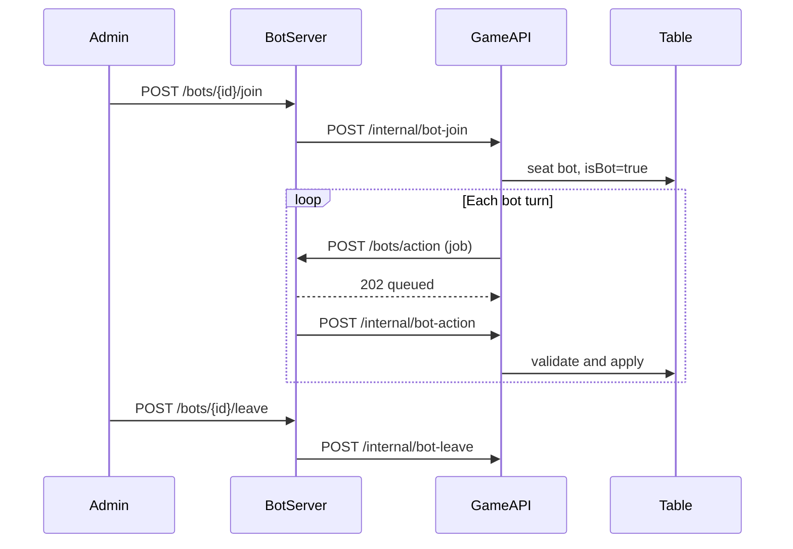

# Game Backend: требования для интеграции с Bot Server

Документ для команды **game backend** (`/opt/poker`, NestJS).  
Bot-server: `https://bot.playesop.net` · спецификация job: `app/schemas/bot_job_schema.py`.

Связанные файлы:

- [GAME-BACKEND-INTEGRATION-PROMPT.md](./GAME-BACKEND-INTEGRATION-PROMPT.md) — промпт для Cursor/задачи
- [DECISION-ENGINE.md](./DECISION-ENGINE.md) — что bot-server делает с полученными данными

---

## 1. Роли и границы

```text
Browser  ←── WebSocket/REST ──→  Game Backend  ←── HTTP ──→  Bot Server
                                      │
                                      ├── POST https://bot.playesop.net/bots/action
                                      └── POST …/internal/bot-action  ← ход бота
```

| Компонент | Ответственность |
|-----------|-----------------|
| **Game Backend** | Правила, колода, банк, валидация, showdown, выплаты, рассылка стола |
| **Bot Server** | Расчёт хода по видимым картам (NLH + Omaha 4–7), задержка, отправка предложения |
| **Браузер** | Только game backend. **Не** вызывает bot-server, **не** хранит `SERVICE_TOKEN` |

**Dashboard:** админ → `bot.playesop.net` → bot-server → `POST /internal/bot-join`. Игроки в браузере этого не видят.

---

## 2. Переменные окружения (обязательно в процессе контейнера)

Добавить в `docker-compose.yml` сервиса **backend** (файл `.env` на диске **недостаточно**, если env не проброшен в контейнер):

```env
INTERNAL_BOT_SERVICE_ENABLED=true
INTERNAL_BOT_SERVICE_TOKEN=<длинный-секрет>
INTERNAL_BOT_SERVICE_TOKEN_EXPIRES_AT=2030-01-01T00:00:00.000Z

BOT_SERVER_URL=https://bot.playesop.net
BOT_SERVER_SERVICE_TOKEN=<тот же секрет, что SERVICE_TOKEN на bot-server>
```

На **bot-server** (отдельный сервер):

```env
MAIN_BACKEND_URL=https://playesop.net/api
SERVICE_TOKEN=<тот же INTERNAL_BOT_SERVICE_TOKEN>
```

### Проверка после деплоя

```bash
cd /opt/poker
sudo docker compose exec backend printenv | grep -E 'INTERNAL_BOT|BOT_SERVER'
```

Ожидается:

```text
INTERNAL_BOT_SERVICE_ENABLED=true
INTERNAL_BOT_SERVICE_TOKEN=...
```

Если **пусто** → Nest не видит переменные → ошибки вида `Internal bot service token is disabled` на join/action.

После правок:

```bash
sudo docker compose up -d --force-recreate backend
```

---

## 3. Internal API

Базовый URL: `https://playesop.net/api` (или ваш API prefix).

Все запросы:

```http
Authorization: Bearer <INTERNAL_BOT_SERVICE_TOKEN>
Content-Type: application/json
```

Ответы при ошибке — JSON с `ok: false` (bot-server парсит тело даже при HTTP 4xx):

```json
{
  "ok": false,
  "errorCode": "INVALID_BOT_SERVICE_TOKEN",
  "message": "Human-readable message"
}
```

### 3.1 `POST /internal/bot-join`

**Кто вызывает:** bot-server (после кнопки Connect в dashboard).

**Request:**

```json
{
  "botId": "cmojrjsch3o4oczpopsmbco3g",
  "tableId": "cmp6vzbxq0001hgegs3ohkze3",
  "isBot": true,
  "preferredSeat": 3
}
```

| Поле | Обязательно | Описание |
|------|-------------|----------|
| `botId` | да | ID пользователя-бота |
| `tableId` | да | ID стола |
| `isBot` | да | `true` |
| `preferredSeat` | нет | Желаемое место |

**Response (успех):**

```json
{
  "ok": true,
  "botId": "...",
  "tableId": "...",
  "seatIndex": 3
}
```

**Поведение backend:** посадить игрока, `isBot=true`, разослать snapshot по WebSocket.

---

### 3.2 `POST /internal/bot-leave`

**Request:**

```json
{
  "botId": "...",
  "tableId": "...",
  "isBot": true
}
```

**Response:** `{ "ok": true }` или `{ "ok": false, ... }`.

---

### 3.3 `POST /internal/bot-action`

**Кто вызывает:** bot-server после расчёта хода (через 2–15 сек после `/bots/action`).

**Request:**

```json
{
  "botId": "...",
  "tableId": "...",
  "handId": "...",
  "turnId": "...",
  "action": "CALL",
  "amount": 50
}
```

| `action` | `amount` |
|----------|----------|
| `FOLD`, `CHECK` | `null` или omit |
| `CALL`, `BET`, `RAISE`, `ALL_IN` | обязателен (фишки) |

**Поведение:** валидировать **как ход человека** → обновить стол → WS snapshot всем.

**Response:** `{ "ok": true }` или `{ "ok": false, "errorCode": "...", "message": "..." }`.

---

### 3.4 `POST /internal/bot-action/validate-turn` (опционально)

Pre-flight проверка, что ход ещё актуален.

**Request:**

```json
{
  "botId": "...",
  "tableId": "...",
  "handId": "...",
  "turnId": "...",
  "legalActions": ["FOLD", "CALL", "RAISE"]
}
```

**Response:** `{ "valid": true }`.

Если эндпоинта нет (404) — bot-server всё равно отправит финальный ход на `/internal/bot-action`.

---

## 4. Вызов Bot Server на ходе бота (критично)

Когда `currentActor` (или аналог) — игрок с **`isBot === true`**:

```http
POST https://bot.playesop.net/bots/action
Authorization: Bearer <BOT_SERVER_SERVICE_TOKEN>
Content-Type: application/json
```

**Ожидаемый ответ: HTTP 202**

```json
{
  "queued": true,
  "jobId": "uuid",
  "botId": "...",
  "tableId": "...",
  "handId": "...",
  "turnId": "...",
  "isBot": true
}
```

### Правила вызова

- Вызывать **асинхронно** (очередь / fire-and-forget), не блокировать стол на 30+ секунд.
- **Один** осмысленный запрос на один `turnId` (не спамить дубликатами).
- При ошибке 422 — в логах bot-server будет detail; чаще всего неверный `gameType` или число карт.
- При таймауте/5xx — залогировать; бот не сходит, стол может зависнуть без fallback.

---

## 5. Контракт job (тело `POST /bots/action`)

### 5.1 Формат A — плоский JSON (рекомендуется)

Все поля в корне объекта.

### 5.2 Формат B — с `visibleState`

```json
{
  "botId": "...",
  "tableId": "...",
  "handId": "...",
  "turnId": "...",
  "street": "FLOP",
  "gameType": "NLH",
  "visibleState": { ... }
}
```

Bot-server нормализует алиасы: `holeCards`, `board`, `communityCards`, `betToCall`, `stack`, `bb`, `players[].holeCards`.

---

## 6. Обязательные поля job

| Поле | Тип | Описание |
|------|-----|----------|
| `botId` | string | ID бота |
| `tableId` | string | ID стола |
| `handId` | string | ID раздачи |
| `turnId` | string | **Уникальный** ID хода |
| `street` | enum | `PREFLOP`, `FLOP`, `TURN`, `RIVER` |
| `gameType` | enum | см. §7 |
| `botHoleCards` | string[] | Только карты бота, формат `As`, `Td` |
| `boardCards` | string[] | См. §8 |
| `potSize` | int | ≥ 0 |
| `currentBet` | int | Текущая ставка для колла |
| `botStack` | int | Стек бота |
| `botCurrentBet` | int | Ставка бота в раунде торгов |
| `legalActions` | string[] | Подмножество `FOLD,CHECK,CALL,BET,RAISE,ALL_IN` |
| `activePlayersCount` | int | ≥ 1 |

---

## 7. `gameType` и количество hole-карт

| `gameType` | Карт в `botHoleCards` | Примечание |
|------------|----------------------|------------|
| `NLH`, `NO_LIMIT_HOLDEM`, `TEXAS_HOLDEM` | **2** | Texas Hold'em |
| `OMAHA_4` | **4** | PLO4 |
| `OMAHA_5` | **5** | PLO5 |
| `OMAHA_6` | **6** | PLO6 |
| `OMAHA_7` | **7** | PLO7 |

Тип стола в БД **должен совпадать** с `gameType` в job.

**Ошибка 422 от bot-server**, если:

- неподдерживаемый `gameType`;
- неверное число hole-карт;
- неверное число карт борда для `street`.

---

## 8. `boardCards` по улице

| `street` | `len(boardCards)` |
|----------|-------------------|
| `PREFLOP` | 0 |
| `FLOP` | 3 |
| `TURN` | 4 |
| `RIVER` | 5 |

Формат карты: **2 символа** — ранг (`2-9`, `T`, `J`, `Q`, `K`, `A`) + масть (`h`, `d`, `c`, `s`).

---

## 9. Рекомендуемые поля (сильно улучшают бота)

| Поле | Зачем на bot-server |
|------|---------------------|
| `bigBlind` | Preflop sizing, steal/defend |
| `minRaise`, `maxRaise` | Легальные размеры рейза |
| `position` | `BTN`, `CO`, `SB`, `BB`, `UTG`, `LATE`, … — **preflop charts** |
| `previousActions` | **Equity vs диапазон** (action history) |

### 9.1 `previousActions`

Массив действий на столе (минимум **текущая улица**). **Без карт оппонентов.**

```json
"previousActions": [
  {
    "playerId": "villain-user-id",
    "action": "RAISE",
    "amount": 60
  },
  {
    "playerId": "villain-user-id",
    "action": "BET",
    "amount": 90
  }
]
```

| Поле | Описание |
|------|----------|
| `playerId` | ID игрока (≠ `botId` для действий оппонентов) |
| `action` | `FOLD`, `CHECK`, `CALL`, `BET`, `RAISE`, `ALL_IN` |
| `amount` | Размер в фишках (для CHECK/FOLD можно `null`) |

Без `previousActions` bot-server использует только эвристику диапазона (всё равно работает, но грубее).

---

## 10. Примеры job

### 10.1 NLH — preflop, open

```json
{
  "botId": "bot-1",
  "tableId": "table-1",
  "handId": "hand-100",
  "turnId": "turn-1",
  "street": "PREFLOP",
  "gameType": "NLH",
  "botHoleCards": ["As", "Kd"],
  "boardCards": [],
  "potSize": 15,
  "currentBet": 10,
  "botStack": 1000,
  "botCurrentBet": 0,
  "bigBlind": 10,
  "position": "BTN",
  "activePlayersCount": 2,
  "legalActions": ["FOLD", "CALL", "RAISE"],
  "minRaise": 20,
  "maxRaise": 1000,
  "previousActions": []
}
```

### 10.2 NLH — flop, facing bet

```json
{
  "botId": "bot-1",
  "tableId": "table-1",
  "handId": "hand-100",
  "turnId": "turn-5",
  "street": "FLOP",
  "gameType": "NLH",
  "botHoleCards": ["Ah", "Kd"],
  "boardCards": ["2d", "3c", "4h"],
  "potSize": 180,
  "currentBet": 60,
  "botStack": 940,
  "botCurrentBet": 0,
  "bigBlind": 10,
  "position": "BTN",
  "activePlayersCount": 2,
  "legalActions": ["FOLD", "CALL", "RAISE"],
  "minRaise": 20,
  "maxRaise": 940,
  "previousActions": [
    { "playerId": "villain-2", "action": "BET", "amount": 60 }
  ]
}
```

### 10.3 Omaha 5 — turn

```json
{
  "botId": "bot-2",
  "tableId": "table-1",
  "handId": "hand-101",
  "turnId": "turn-8",
  "street": "TURN",
  "gameType": "OMAHA_5",
  "botHoleCards": ["As", "Kd", "Qh", "Jc", "Ts"],
  "boardCards": ["2d", "3c", "4h", "9s"],
  "potSize": 420,
  "currentBet": 120,
  "botStack": 1580,
  "botCurrentBet": 0,
  "bigBlind": 10,
  "position": "CO",
  "activePlayersCount": 3,
  "legalActions": ["FOLD", "CALL", "RAISE"],
  "minRaise": 40,
  "maxRaise": 1580,
  "previousActions": [
    { "playerId": "v3", "action": "RAISE", "amount": 80 },
    { "playerId": "v4", "action": "CALL", "amount": 80 }
  ]
}
```

---

## 11. UI и WebSocket snapshot

Для каждого места за столом:

```json
{
  "id": "user-id",
  "displayName": "BOT Alpha",
  "isBot": true,
  "seatIndex": 2,
  "stack": 2000,
  "currentBet": 0
}
```

| Требование | Описание |
|------------|----------|
| `isBot: true` | Только для ботов |
| Бейдж **BOT** | В интерфейсе |
| «Думает…» | Когда `currentActorId` = бот и ход ещё не завершён |
| Не светить hole cards оппонентов | В job только `botHoleCards` бота |

Дополнительно для отладки (опционально):

- `handId`, `street` в snapshot;
- `currentActorId`.

---

## 12. Поток жизненного цикла



---

## 13. Что НЕ делает game backend

- Не считает equity / силу руки для бота (это bot-server + PokerKit).
- Не дублирует логику preflop charts.
- Не отдаёт `SERVICE_TOKEN` / URL bot-server в браузер.
- Не шлёт в job карты оппонентов.
- Не использует Redis bot-server с другого сервера без HTTP `POST /bots/action`.

Showdown и финальные комбинации — **только** game engine.

---

## 14. Минимальный объём работ в коде (NestJS)

| # | Задача |
|---|--------|
| 1 | `ConfigModule`: `INTERNAL_BOT_*`, `BOT_SERVER_*` из `process.env` |
| 2 | `BotServiceTokenGuard` на маршрутах `/internal/bot-*` |
| 3 | `InternalBotController`: join, leave, action |
| 4 | `BotSeatService`: посадка/снятие, флаг `isBot` в БД |
| 5 | `BotTurnDispatcher`: при ходе бота → HTTP POST `BOT_SERVER_URL/bots/action` |
| 6 | Сборка job из table state (карты, банк, legalActions, **previousActions**) |
| 7 | `internal/bot-action` → тот же pipeline валидации, что у человека |
| 8 | DTO snapshot: `isBot`, `currentActorId` для WebSocket |
| 9 | Docker: `env_file` / `environment` для `INTERNAL_BOT_*` |
| 10 | Логирование: вызов bot-server, ответ, `turnId`, ошибки 422 |

---

## 15. Чеклист приёмки

- [ ] `docker compose exec backend printenv \| grep INTERNAL_BOT` — не пусто
- [ ] `curl /internal/bot-join` → `"ok": true` для реального `tableId`
- [ ] Бот садится, в UI виден бейдж BOT
- [ ] На ходе бота уходит `POST /bots/action` → 202 `queued`
- [ ] Через несколько секунд приходит `POST /internal/bot-action`
- [ ] Стол обновляется, раздача продолжается
- [ ] NLH: 2 hole-карты; Omaha: 4/5/6/7 по типу стола
- [ ] `boardCards`: 0/3/4/5 по улице
- [ ] `gameType` совпадает с типом стола
- [ ] `legalActions` актуальны
- [ ] `position`, `bigBlind`, `minRaise` заполнены
- [ ] `previousActions` передаётся на postflop (желательно)
- [ ] Токен одинаковый на game backend и bot-server
- [ ] `/internal/bot-leave` снимает бота со стола

---

## 16. Тестовые команды

```bash
# 1. Join
curl -s -X POST "https://playesop.net/api/internal/bot-join" \
  -H "Authorization: Bearer <TOKEN>" \
  -H "Content-Type: application/json" \
  -d '{"botId":"<bot-user-id>","tableId":"<table-id>","isBot":true}'

# 2. Enqueue bot turn (с сервера, где есть sample-job.json)
curl -s -X POST "https://bot.playesop.net/bots/action" \
  -H "Authorization: Bearer <TOKEN>" \
  -H "Content-Type: application/json" \
  -d @sample-job.json

# 3. Логи bot-server
sudo docker compose -f docker-compose.prod.yml logs -f bot-worker
```

---

## 17. Типичные ошибки

| Симптом | Причина | Решение |
|---------|---------|---------|
| `Internal bot service token is disabled` | `INTERNAL_BOT_*` не в env контейнера | `environment:` в compose + `--force-recreate` |
| 502 Connect to Game на dashboard | join отклонён backend | п.1 + проверка `curl bot-join` |
| Бот «замирает» | нет `POST /bots/action` | BotTurnDispatcher на `isBot` |
| 422 от bot-server | неверный `gameType`/карты | §7–8 |
| Бот играет плохо на Omaha | шлёте `NLH` + 2 карты | правильный `gameType` и 4–7 карт |
| Слабые коллы postflop | нет `previousActions` | добавить историю улицы в job |

---

*Версия: bot-server с PokerKit 0.7.3, preflop charts (NLH/Omaha), equity + action history.*
